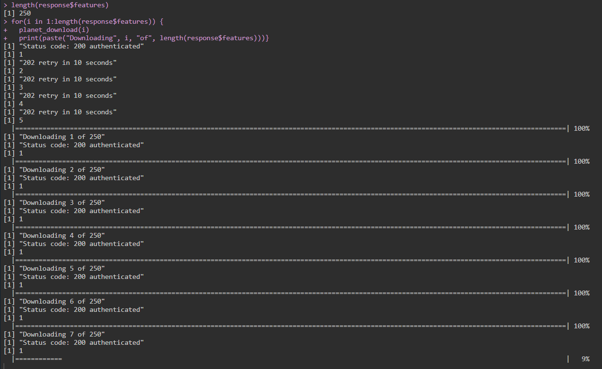

# planetR

Some R tools to search, activate and download satellite imagery from the Planet API (https://developers.planet.com/docs/api/). The current purpose of the package is to Search the API, batch activate all assets, and then batch download them. 

There are two API's: 
- v1 Planet API
- v2 Planet Orders API (can clip and pre-process scenes to AOI on server)

### Functions

```{r functions}

## current functions (API v1)
planetR::planet_search()
planetR::planet_activate()
planetR::planet_download()

## current functions (Orders API v2)
planetR::planet_order_request()
planetR::planet_order_download()
planetR::planet_order()

```

### Installation

You can install planetR directly from this GitHub repository. To do so, you will need the remotes package. Next, install and load the planetR package using remotes::install_github():

```{r installation}
install.packages("remotes")
remotes::install_github("bevingtona/planetR")
library(planetR)
```

#### Example using Planet Orders API v2

This is an example of how to search, activate and download assets using `planetR`.

```{r example}

#### LIBRARIES ####
library(planetR)
library(httr)
library(jsonlite)
library(raster)
library(stringr)
library(sf)

#### USER VARIABLES ####

# Site name that will be used in the export folder name
site = "MySite"

# Set Workspace (optional)
setwd("")

# Set API
api_key = "" 

# Date range of interest
date_start <- as.Date("2022-01-01")
date_end   <- as.Date("2022-04-01")

# Metadata filters
cloud_lim <- 0.02 # percent from 0-1
item_name <- "PSScene" # (see https://developers.planet.com/docs/data/items-assets/)
product_bundle <- "analytic_8b_sr_udm2" # https://developers.planet.com/docs/integrations/gee/delivery/
asset <- "ortho_udm2" # (see https://developers.planet.com/docs/data/items-assets/)

# Set AOI (many ways to set this!) ultimately just need an extent()
# OPTION 1: Import feature
my_aoi       = read_sf("path_to_file.sqlite") # KML, SHP, SQLITE, or other
bbox         = extent(my_aoi)
# OPTION 2: Digitize om map
my_aoi       = mapedit::editMap() # Set in GUI
bbox         = extent(my_aoi)
# OPTION 3: Set bounding box manually
bbox         = extent(-129,-127,50,51)

# Set/Create Export Folder
exportfolder <- paste(site, item_name, asset, lubridate::year(date_start), lubridate::year(date_end),  lubridate::yday(date_start),  lubridate::yday(date_end), sep = "_")

if(!(dir.exists("exports"))){
dir.create("exports", showWarnings = F)
}

dir.create(file.path("exports", exportfolder), showWarnings = F)

# Planet Orders API

planet_order(api_key = api_key, 
             bbox = bbox, 
             date_end = date_end,
             date_start = date_start,
             cloud_lim = cloud_lim, 
             item_name = item_name, 
             product_bundle = product_bundle,
             asset = asset,
             mostrecent = 1, # downloads the 1 most recent image
             order_name = exportfolder)
             

[1] "Found 6 suitable PSScene4Band analytic_sr images"
[1] "Day of year: 290-300"
[1] "Year: 2016-2020"
[1] "Save the Order ID: cd16bf13-2f18-47e1-84ad-1d3d280326e3"
[1] "You can restart the download with `planet_order_download(order_id, order_name)`"
[1] "Order still being proccessed, trying again in 60 seconds..."
[1] "queued"
[1] "Order still being proccessed, trying again in 60 seconds..."
[1] "running"
[1] "Order still being proccessed, trying again in 60 seconds..."
[1] "running"
[1] "Order still being proccessed, trying again in 60 seconds..."
[1] "running"
[1] "Order still being proccessed, trying again in 60 seconds..."
[1] "running"
[1] "Order still being proccessed, trying again in 60 seconds..."
[1] "running"
[1] "Order still being proccessed, trying again in 60 seconds..."
[1] "running"
[1] "Order still being proccessed, trying again in 60 seconds..."
[1] "running"
[1] "Order still being proccessed, trying again in 60 seconds..."
[1] "running"
[1] "Starting download"
[1] "Download: 4%"
[1] "Download: 8%"
[1] "Download: 10%"
[1] "Download: 20%"
[1] "Download: 20%"
[1] "Download: 20%"
[1] "Download: 30%"
[1] "Download: 30%"
[1] "Download: 40%"
[1] "Download: 40%"
[1] "Download: 40%"
[1] "Download: 50%"
[1] "Download: 50%"
[1] "Download: 60%"
[1] "Download: 60%"
[1] "Download: 60%"
[1] "Download: 70%"
[1] "Download: 70%"
[1] "Download: 80%"
[1] "Download: 80%"
[1] "Download: 80%"
[1] "Download: 90%"
[1] "Download: 90%"
[1] "Download: 100%"
[1] "Download: 100%"
[1] "Download complete"
[1] "Items located in ../MySite_PSScene4Band_analytic_sr_2016_2020_290_300"

```

#### Example using Planet API v1

```{r example_v1}

# PLANET_SEARCH: Search API

  response <- planet_search(bbox = bbox,
              date_end = date_end,
              date_start = date_start,
              cloud_lim = cloud_lim,
              item_name = item_name,
              asset = asset,
              api_key = api_key)
              
  print(paste("Images available:", length(response), item_name, asset))

# PLANET_ACTIVATE: Batch Activate 

for(i in 1:nrow(response)) {
  planet_activate(i, item_name = item_name)
  print(paste("Activating", i, "of", nrow(response)))}

# PLANET_DOWNLOAD: Batch Download 

for(i in 1:nrow(response)) {
  planet_download(i)
  print(paste("Downloading", i, "of", nrow(response)))}
  
```



### Project Status

Very early/experimental status. 

### Getting Help or Reporting an Issue

To report bugs/issues/feature requests, please file an [issue](https://github.com/bevingtona/planetR/issues/).

### How to Contribute

If you would like to contribute to the package, please see our 
[CONTRIBUTING](CONTRIBUTING.md) guidelines.

Please note that this project is released with a [Contributor Code of Conduct](CODE_OF_CONDUCT.md). By participating in this project you agree to abide by its terms.

### License

```
Licensed under the Apache License, Version 2.0 (the &quot;License&quot;);
you may not use this file except in compliance with the License.
You may obtain a copy of the License at

http://www.apache.org/licenses/LICENSE-2.0

Unless required by applicable law or agreed to in writing, software distributed under the License is distributed on an &quot;AS IS&quot; BASIS,
WITHOUT WARRANTIES OR CONDITIONS OF ANY KIND, either express or implied.
See the License for the specific language governing permissions and limitations under the License.
